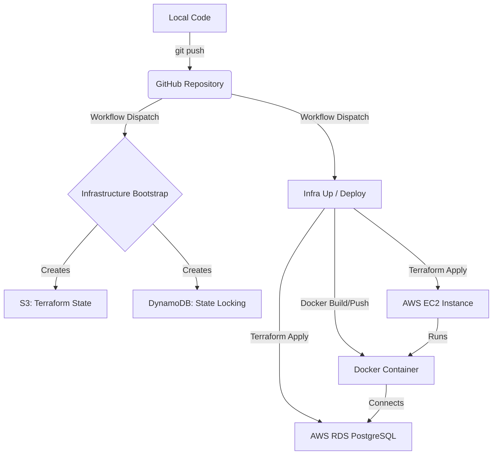

# 🚀 Ultimate AWS Deployment Guide (GitHub Actions + Terraform)

> **Goal:** This is a zero-to-hero guide to deploying a Node.js application on AWS using **Terraform** for infrastructure and **GitHub Actions** for CI/CD. It includes **Infrastructure Bootstrapping** (S3 + DynamoDB for state), **EC2 Instance**, and **RDS PostgreSQL**.

---

## 🧠 Core Philosophy
- **Infrastructure as Code (IaC):** Never create resources manually in the AWS console. Use Terraform.
- **Continuous Deployment (CD):** Every push/dispatch should automatically update your app.
- **Self-Healing State:** Use S3 and DynamoDB to manage Terraform state across different environments.
- **Zero Cost Mindset:** Destroy everything when non-essential to save costs.

---

## 🏗️ Architecture Overview



---

## 📁 Project Structure

```text
.
├── .github/workflows/
│   ├── infra-bootstrap.yml   # Step 0: Initial state setup
│   ├── infra-up.yml          # Manual creation of app infra (EC2 + RDS)
│   ├── infra-deploy.yml      # CI/CD: Builds and Deploys app to EC2
│   └── infra-destroy.yml     # Manual destruction of app infra
├── infra/
│   ├── backend.tf            # State configuration
│   ├── main.tf               # EC2, RDS, Security Groups
│   ├── variables.tf          # Configurable inputs
│   └── outputs.tf            # IP, DB Endpoints
├── src/
│   ├── index.js              # Node.js source
│   └── db.js                 # Database connection (pg)
├── Dockerfile                # Container recipe
└── .gitignore                # Files to ignore
```

---

## 🔐 Prerequisites: GitHub Secrets

Before running anything, add these **GitHub Secrets** to your repository:

1.  `AWS_ACCESS_KEY_ID`: Your AWS Access Key.
2.  `AWS_SECRET_ACCESS_KEY`: Your AWS Secret Key.
3.  `EC2_KEY`: Your private SSH key (`.pem`) converted to **Base64**.
    - Command: `base64 -w 0 your-key.pem`
4.  `JWT_SECRET`: Secret key for JWT signing.

---

## 🟢 Step 1: Bootstrap Infrastructure State (One-Time)

Terraform needs a place to store its **State File** (`.tfstate`). We use **S3** for storage and **DynamoDB** for locking.

### 📜 GitHub Workflow: `infra-bootstrap.yml`
Go to **GitHub Actions > Infrastructure Bootstrap > Run workflow**.
Provide a unique bucket suffix (e.g., `skool-2026`) and type `bootstrap`.

### 📝 Configuration: `infra/backend.tf`
Update this file with the bucket name generated by the bootstrap workflow.

```hcl
terraform {
  backend "s3" {
    bucket         = "tf-state-2026-terraform-state" # Update this!
    key            = "terraform.tfstate"
    region         = "ap-south-1"
    encrypt        = true
    dynamodb_table = "demo-app-terraform-locks"
  }
}
```

---

## 🟢 Step 2: Provision Infrastructure (EC2 + RDS)

Now that we have a backend for state, we can create the actual resources.

### 📜 GitHub Workflow: `infra-up.yml`
Go to **GitHub Actions > Infra Up > Run workflow**.

This workflow creates:
1.  **EC2 Instance**: For running the Docker container.
2.  **RDS PostgreSQL**: Managed database instance.
3.  **Security Groups**: Properly configured ports (80 for app, 5432 for DB).

---

## 🟢 Step 3: Application Deployment

The application is deployed via the `infra-deploy.yml` workflow.

### 📜 GitHub Workflow: `infra-deploy.yml`
It performs these steps:
1.  **Terraform Init**: Syncs with S3 state.
2.  **Get Outputs**: Fetches EC2 IP and RDS Endpoint dynamically.
3.  **Docker Build**: Creates a production image.
4.  **Save/Copy Image**: Transfers the image to EC2 via SCP.
5.  **Remote SSH**:
    - Loads the Docker image.
    - Restarts the container with correct environment variables:
      - `DATABASE_URL`: Constructed using RDS Endpoint.
      - `JWT_SECRET`: From GitHub Secrets.

---

## 🔴 Step 4: Destroy & Cleanup (Save Cost)

When your demo is done, destroy all AWS resources to avoid billing.

### 📜 GitHub Workflow: `infra-destroy.yml`
Go to **GitHub Actions > Infra Destroy > Run workflow** and type `destroy`.

> [!IMPORTANT]
> RDS snapshots are **not** created by this workflow to ensure full cleanup. If you need data persistence, create a snapshot manually before destroying.

---

## 🚀 How to Run (Quick Start)

Once the infrastructure is up, your app is automatically deployed on every push to `master`.

1.  **View logs**: `docker logs demo` on the EC2 instance.
2.  **API Endpoints**:
    - `GET /`: Health check.
    - `POST /signup`: Create a user (JSON body: `username`, `password`).
    - `POST /login`: Get JWT token.

> [!TIP]
> For a deep dive into how everything works, read the [Deploy Process Guide](file:///media/github/skool.ai/backend/terraform-node-postgres-flow/Deploy_process.md).

---

## 📖 Glossary of Terms

| Term | Explanation |
| :--- | :--- |
| **S3 Backend** | Stores the "memory" of your infrastructure. |
| **State Lock** | Prevents concurrent Terraform runs from corrupting state. |
| **User Data** | Script that installs Docker on EC2 at first boot. |
| **RDS** | Relational Database Service (Managed PostgreSQL). |
| **Base64 Key** | Encoded SSH key to avoid formatting issues in Secrets. |

---

## ❌ Common Troubleshooting

-   **Error: `no pg_hba.conf entry`**: AWS RDS requires SSL. Ensure `DATABASE_URL` has `?sslmode=require`.
-   **Error: `SELF_SIGNED_CERT_IN_CHAIN`**: RDS uses self-signed certs. Ensure `src/db.js` has `rejectUnauthorized: false` in the SSL config.
-   **Error: `bucket not found`**: Ensure bootstrap ran and `backend.tf` is updated.
-   **Error: `Connection timed out`**: Check if Security Groups allow traffic on port 80/5432.
-   **Error: `invalid format` for key**: Ensure the `EC2_KEY_B64` is Base64 encoded without newlines.

---

## 🛠️ Full Setup Checklist (Summary)

1.  **Fork/Clone** the repo.
2.  **Add Secrets** to GitHub (`AWS_ACCESS_KEY_ID`, `AWS_SECRET_ACCESS_KEY`, `EC2_KEY_B64`, `JWT_SECRET`).
3.  **Run Bootstrap** workflow in GitHub Actions.
4.  **Update `infra/backend.tf`** with the generated bucket name.
5.  **Run Infra Up** workflow.
6.  **Push code** to master (triggers `infra-deploy.yml`).
7.  **Verify app** at `http://<EC2_IP>`.

✅ **Deployment Complete!** You now have a full-stack automated pipeline.
